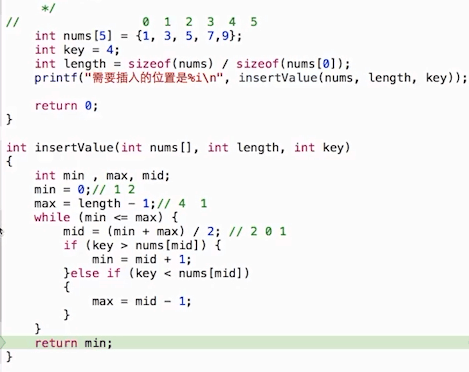
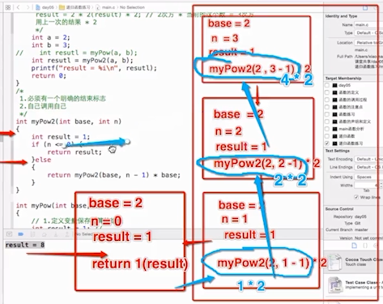
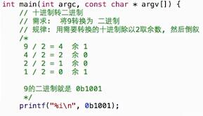
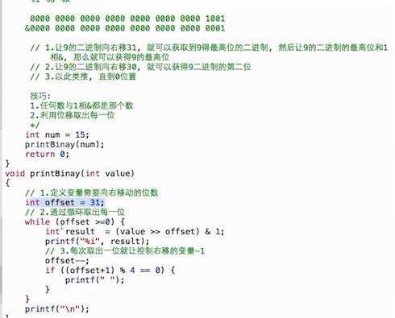
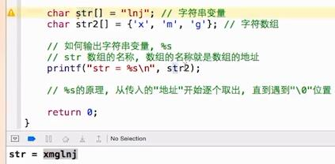
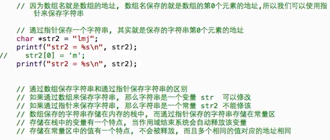

#####Command-Shift-3截图整个屏幕，
#####Command-Shift-4截取指定区域,
#####Command-Shift+control+左，折叠注释代码，
#####Command-option-上/下移动

### %d-->int类型，%zd-->NSInteger
####C语言排序算法总结
- http://www.codeceo.com/article/10-sort-algorithm-interview.html?url_type=39&object_type=webpage&pos=1
`冒泡算法`
        外部的循环，数组有多少个数字，就循环count-1次，内部的循环是每一个数字和它前一个数字的比较，从数组的最后一个位置开始两两比较array[index]和array[index-1]，如果array[index]大于array[index-1]则交换array[index]和array[index-1]的位置，止到数组结束(4 8 5 3)

      //特点：是用相邻的两个元素进行比较，每完全比较完一次，最值出现在顶端或者末尾，比如ABCD四个数，是A和B，B和C，C和D比较算一次，而不是A和B，A和C，A和D
              for(int i=0;i<count-1;i++)//外部循环
             {
                for(int j=count-1;j>i;j--)
                  {
                      if(a[j]<a[j-1])//从小到大
                       {//4835  4385  3485
                        //3458
                          int temp=a[j];
                          a[j]=a[j-1];
                          a[j-1]=temp;
                       }
                   }
             }
             //优化
             for(int j=0;j<count-1-i;j++  )
                  {
                      if(a[j]<a[j-1])//从小到大
                       {//4835  4385  3485
                        //3458
                          int temp=a[j];
                          a[j]=a[j-1];
                          a[j-1]=temp;
                       }
                   }

`选择排序`

    选择排序原理：默认以array[0]的值作为最小值，然后依次和其他元素进行比较，完全比较完一次后，最小值出现在第0位，比如ABCD四个数，是A和B，A和C，A和D


`冒泡和选择算法比较`

    两者的时间复杂度是一样的O(n^2)，但是选择排序由于有一个标杆，所以可以减少数组交换的次数，而冒泡即使最后一次数组已经排好序它还是会进行最后一次审核，直到对比结束发现完全对了才会停止(5438)
    int minIndex=0；//定义一个索引，默认a[0]就是最小的
        for(i=0;i<count-1;i++)//外层循环
        {    minIndex=i;//第一轮循环结束，第一个就是最小的，第二轮循环结束，前两个数就是按照从小到大顺序排的，以此类推
            for(j=i+1;j<count;j++)
            {
               if(a[j]<a[minIndex])
                {
                 minIndex=j;
                }
            }
                if(minIndex!=i)//不相等，说明找到了比当前数还小的数
                {
                 int temp=a[i];
                 a[i]=a[minIndex];
                 a[minIndex]=temp;
                }
        }
               //内部循环可优化
         for(j=i+1;j<count;j++)
            {
               if(a[j]<a[i])
                {
                 int temp=a[i];
                 a[i]=a[j];
                 a[j]=temp;
                }
            }


- 插入排序（原理就是折半查找）


###常识点
- 静态数据类型是指一些永久性的数据，一般存储在硬盘中，只要不主动删除数据永远都在
- 动态数据类型是指一些在运行过程中动态产生的临时数据，一般存储在内存中，内存的存储空间比较小，计算机关闭之后，这些临时的数据源就会被清除，当程序运行时，整个程序就会被加载到内存中，在程序运行过程中，产生的各种各样的临时数据都是被存放在内存中，当程序停止运行或者计算机关闭，这个程序产生的临时数据都会被清除。
- 之所以要有动态数据和静态数据的区分就是因为内存的访问速度比硬盘访问速度快N倍
- 取模%运算符，结果的正负取决于第一个数据类型的正负，比如2%3=2，-2%3=-2，2%-3=2，-2%-2=-2

```objc
-数据类型转换，double a=1/2,a=0.000000，原因是转换过程中，编译器会先考虑参与运算的数据的类型，这里是用的整形，所以运算结果就是整形0，然后再赋值给a，a是double类型的，所以最终a就是0.000000
-double a=(double)10.2/2=5.1，参与运算的2个数据类型不一样的话，编译器会按照字节数高的类型进行运算，这里double比int字节多，所以按照double进行运算，最后再赋值给a
```
- sizeof是一个运算符，不是一个函数，可以计算变量、常量、数据类型占用的字节大小，sizeof(char)，数据类型不可以省略(),变量和常量可以省略()

`生成随机数`

   // arc4random_uniform方法会根据传入的整数生成一个随机数
  //生成的值就是0-（N-1）的值
   int a=arc4random_unifor(3)//生成的就是0-2的随机数

`break和continue`

    break是用与跳出当前循环体，不再执行当前循环，如果存在多层循环，那么只跳出当前循环
    continue是用于跳出本次循环体，继续执行下一次循体环
    2者跳出的时候后面的代码都不再执行，只不过break是永远都不再执行这个循环了，而continue是继续执行下一次循环

- 在for循环中：
 - 尖尖朝上：修改内部循环的条件表达式
 - 尖尖朝下：修改内部循环的初始化表达式
- 递归：函数自己在内部调用自己
 - 使用递归一定要有一个明确的结束条件，否则会造成死循环


- 进制

在c语言中没有以2进制输出的占位符
 - 二进制 0b1100
 - 八进制 014    ，  可以以%o形式输出
 - 十进制 12     ，  可以以 %i，%d形式输出
 - 十六进制 0xc  ，  可以以%x形式输出
 - 十进制转二进制
  
 - 二进制转十进制  1101 ==13
 - 二进制转八进制  1001(十进制 9)->001 001(八进制011)
 - 二进制转十六进制 11001(十进制25)->0001 1001(十六进制0x19)
 - 编写一个函数，十进制转二进制
 

- 判断奇偶数   num&1
- 交换2个数    a=a^b,b=a^b,a=a^b
- %s输出原理：

- 指针字符串是常量，普通字符串是变量

