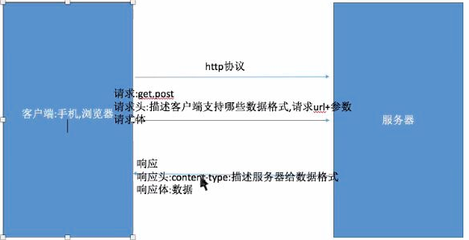

# 面试题
1）`__nonnull`和 `__nullable`
- [相关博客地址](http://blog.sina.com.cn/s/blog_5c91824f0102vxpd.html)
- __nullable表示对象可以是NULL或nil，而__nonnull表示对象不应该为空，可以用作方法参数修饰还可以用在Property里面
- 苹果在Xcode 6.3引入了一个Objective-C的新特性：nullability annotations
- 目的是为了解决oc与swift混编造成的问题，也就是以下问题：

我们都知道在swift中，可以使用!和?来表示一个对象是optional的还是non-optional，如view?和view!。而在Objective-C中则没有这一区分，view即可表示这个对象是optional，也可表示是non-optioanl。这样就会造成一个问题：在Swift与Objective-C混编时，Swift编译器并不知道一个Objective-C对象到底是optional还是non-optional，因此这种情况下编译器会隐式地将Objective-C的对象当成是non-optional。

- 比如我们声明一个方法`- (id)itemWithName:(NSString * __nonnull)name;`
-  然后调用它，但是我们给它的参数name传一个nil，这个时候编译器会警告，但是程序还是能编译通过并运行
- 事实上，在任何可以使用const关键字的地方都可以使用__nullable和__nonnull，不过这两个关键字仅限于使用在指针类型上。而在方法的声明中，我们还可以使用不带下划线的nullable和nonnull
- 声明属性可以这样写
`@property (nonatomic, copy, nonnull) NSArray * items;`
- 但是更推荐这样写
`@property (nonatomic, copy) NSArray * __nonnull items;`

######Nonnull区域设置(Audited Regions)
- 如果需要每个属性或每个方法都去指定nonnull和nullable，是一件非常繁琐的事。苹果为了减轻我们的工作量，专门提供了两个宏：NS_ASSUME_NONNULL_BEGIN和NS_ASSUME_NONNULL_END
- 在这两个宏之间的代码，所有简单指针对象都被假定为nonnull

```objc
NS_ASSUME_NONNULL_BEGIN
//items是不可以为空的
@property (nonatomic, copy) NSArray * items;
//参数name是可以为空的，但是该方法的返回值不可以为空
- (id)itemWithName:(nullable NSString *)name;
NS_ASSUME_NONNULL_END
```
- `null_unspecified`:不确定是否可以为空(极少情况)
- `null_resettable`:set方法可以为nil，get方法不可返回nil

---
2）简述JSON/XML数据格式
json是类似oc中的字典一样的格式，而xml
3）简述Http和Https


---
4）简述NSURLSession和NSURLconnection的区别

     1)session支持http2.0协议
     2)NSURLSession在处理下载任务的时候可以直接把数据下载到磁盘
     3)支持后台下载|上传
     4)同一个session发送多个请求，只需要建立一次连接（复用了TCP）
     5)提供了全局的session并且可以统一配置，使用更加方便
     6)下载的时候是多线程异步处理的效率更高

