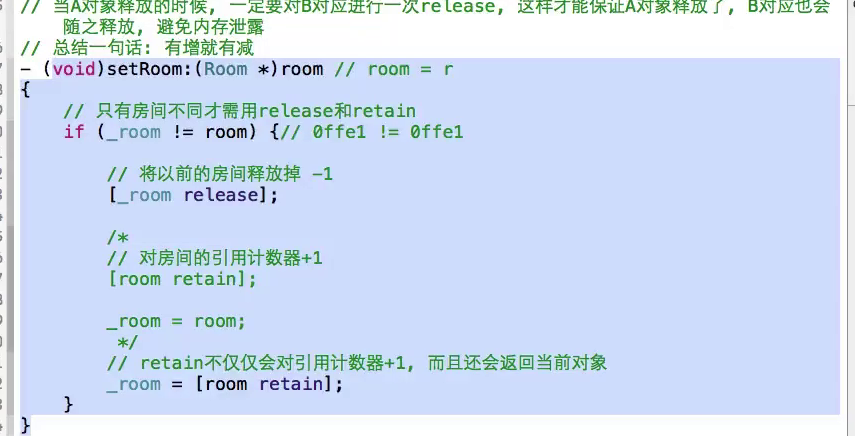
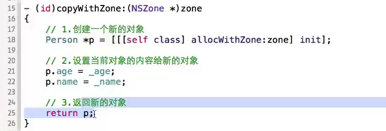
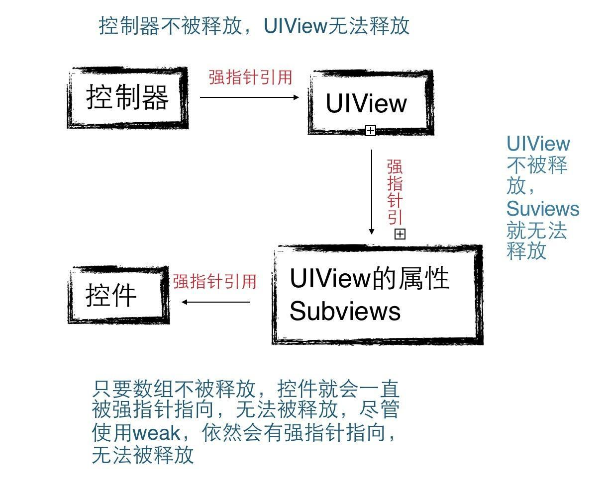
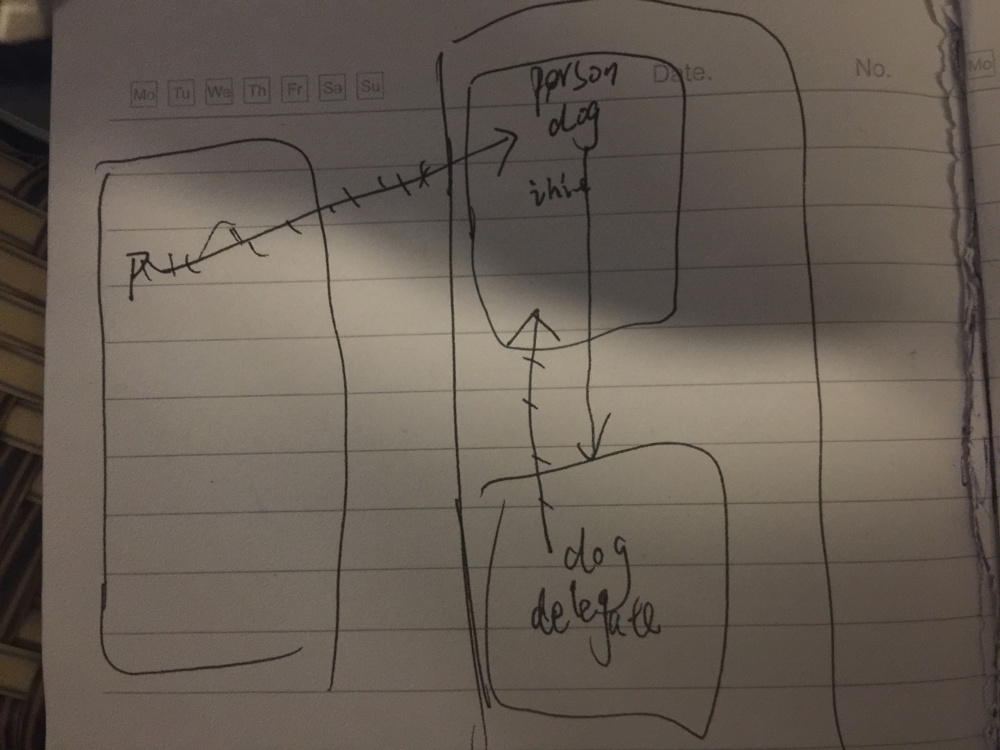
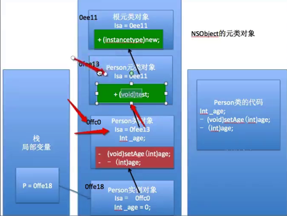

# OC语法（面试）
OC是面向对象的，将功能封装进对象，强调了具备功能的对象，关注的是解决问题需要哪些对象，将复杂的问题简单化；C是面向过程的，强调的是解决问题需要哪些步骤，什么都要亲力亲为
```objc
#成员变量作用域修饰符
1、protected：默认就是这个，实例变量能被声明他的类和其子类进行访问
2、private：只能在声明的类中进行访问,其他类和子类都不可以访问
3、package：介于private和public之间，如果是在其他包中访问那么就是私有的，如果是在当前代码所在的包中访问就是public
4、在.h文件中，无论是private/public/protected/package修饰成员变量，我们都可以在其他类中看到这个变量，只不过有的不可以
操作，但是在.m文件中，声明的实例变量，默认就是私有的，而且和private不同的地方在于，该成员变量在其他类中也无法查看，只能在本类中访问.
5、如果只有方法的实现而没有声明，那么该方法就是私有方法，在oc中没有真正的私有方法，因为oc是消息机制，会进行动态绑定，会在运行的时候才会确定对象的真实类型或者去查看有没有这个方法
```

- 自定义构造方法限制宏（高级宏）


```objc
# @class
提高编译效率；可以简单的引用一个类，它仅仅告诉编译器Dog是一个类，而不会包含Dog这个类的所有内容，也就是编译器并不知道这个类中有哪些属性和方法！
这个也就是它和#import（预编译指令，会在将代码翻译成0和1之前把引用的类文件内容直接拷贝一份到引用的地方）的区别；
//@class:两个应用场景
1、@class使用在.h文件中，#import使用在.m中，并且#import有一个特点，只要“”中的文件发生了变化，那么#import就会重新拷贝一次，如果都在.h中#import，
假如A拷贝了B，B拷贝了C，如果C被修改了，那么A和B都需要重新拷贝，但是如果在.h中用@class，.m中使用#import，如
果一个文件发生了变化，只有和这个文件有直接关系的那个文件才会重新拷贝
2、当A引用B，B中又引用A的时候，如果在.h文件中使用#import会造成循环拷贝
这种死循环的情况，会报无法识别该类的错误，但是使用@class则不会出现错误，不会循环拷贝
```
```objc
#autorelease
//好处：不用关心对象什么时候释放，只要能够访问对象的地方都可以使用该对象，多个池子是以栈的形式存在的（先进后出），它的本质是延迟release操作
//注意：不要在池子中存放占内存比较大的对象，而且尽量也不要在池子中使用循环
1、对一个对象发送autoreleas消息，会将这个对象放入自动释放池，然后在这个池子销毁的时候自动向对象发送release消息，如果有多个池子，对象加入哪个池子就在哪个池子销毁时接收release消息，在同一个池子中如果对一个对象发送多次autoreleas消息，那么在池子销毁时就会进行多次的release操作，这样容易造成野指针。
2、在一个自动释放池pool中，如果对象person调用了A方法，恰好在A方法中创建了一个student对象，而且student对象接收了一个autoreleas消息，那么相当于把student对象添加到了外面的那个pool池子中，在pool池子销毁时，会对student对象发送一个release操作
3、通过以下类工厂方法创建的对象，系统会自动把该对象加入自动释放池，而且在系统自带的Foundation框架里面的类，通过类工厂方法创建的对象都是会自动把该对象加入自动释放池的
+Person{
    return [[self alloc]init autorelease];
 }
alloc init方法创建的才需要我们自己销毁

```


`dynamic name`
- 告诉系统我要自己生成`name`属性的get和set方法，不用你帮我生成

`#@property   编译器指令`

    1.在xcode4.4之前（@property int age），用它声明一个变量，编译器会自动生成该属性的getter/setter的声明，需要配合@synthesize使用，它会自动帮我们生成对应属性的实现
    2. @property增强：在xcode4.4之后，只要利用一个@property，就可以同时生成一个属性的getter/setter方法的声明和实现，此时没有告诉系统需要将传入的值赋值给谁，那么系统默认会赋值给_下划线开头的成员变量（系统会自动给我们生成一个下划线开头的成员变量，并且默认是私有变量，相当于是在.m中生成的不是在.h中生成的
    3．@property有一个弊端，它只会生成最简单的getter/setter方法的声明和实现，并不会对传入的值进行过滤，如果需要过滤，那么需要我们自己重写存取方法，如果重写了getter，那么@property只会帮我们生成setter，反之同理，如果同时重写存取方法，那么系统不会帮我们生成下划线开头的成员变量
    4. @property修饰符
    ARC是编译器特性，xcode的一个功能，不是运行时特性，它的判断准则是一个对象只要没有强指针指着，对象就会被释放，默认情况下所有指针都是强指针
        retain：修饰对象，写上这个属性，系统就会帮我们自动生成set/get方法的内存管理代码，如图-内存管理set方法



 ```objc
 ，对象引用计数会加1，在MRC中使用
strong：对应MRC中的retain，强引用，只有OC对象才能够使用该属性，一个对象只要有强指针指着，就不会被释放，有2个指针指向同一个内存地址的意思

copy：会在内存里拷贝一份对象，2个指针指向不同的内存地址，只要是拷贝的对象，内容和之前的对象里面的内容是一样的，一个对象的修改不能影响另一个对象里面的东西，使用copy生成的对象都是不可变的，使用mutablecopy生成的对象都是可变的，除了使用不可变的对象调用copy方法不会生成新对象之外，其他都会生成新对象
浅拷贝：不会生成新对象，也是指针拷贝，因为无论是之前的还是之后的对象都是不可变的
深拷贝：会生成新的对象，本质就是创建一个新的内容
//copy内存管理：因为浅拷贝不会生成新的对象，所以它会对之前的对象进行一次retain操作，因为深拷贝会生成新的对象，所以不会对原有对象再一次进行retain但是会对新的对象进行一次retain操作
//字符串需要使用copy修饰：就是防止字符串被别人任意修改，防止外界修改内部的数据
//block需要使用copy修饰：（这里使用copy并不是拷贝的意思，而是转移）
情景1：person类里面定义了一个block，block里面用到了dog类的对象
dog对象是一个局部变量，block存在于一个方法里面，block里面访问到了dog对象，但是有可能代码块的大括号过了block还没有被回调，这个时候局部变量dog已经死了，block被回调到的时候里面访问了已经销毁的局部变量dog就会出现问题
dog对象在block调用之前提前销毁，block里面访问到了dog对象，后续调用block的时候就会报错，所以使用copy修饰它就是防止这个现象，block默认在栈中，如果使用copy就会从栈转移到堆，并对它里面的对象发送一条retain消息，这样可以保证在调用block之前保住dog对象的命，后续如果person对象释放了，在person类的dealloc方法中需要对bloc发送一条release消息，这时block里面的对象都会进行一次release，防止内存泄露
block在使用copy修饰之后引发的循环引用：（本类自己定义的block，block里面用到了本类自己）
情景：person类里面定义了一个属性name和一个block，block里面访问到了person里面的name属性 ，此时需要使用__block修饰对象
block里面访问到了name属性，在MRC中，是person对象的引用计数增加，使用__block可以不让它的引用计数增加，在ARC中是，你指着我，我指着你，都无法释放，使用__weak解决
自定义类的copy实现：遵守协议，实现方法，方法中遵守copy原则，生成新对象，给新对象属性赋值，返回新对象，如图
```
` 如图 `


---
- 字符串使用copy或者strong


- property(nonaotumatic,copy)NSMutalbleString *name;
 - 这样写容易出现问题，一旦外界有人修改name，那么系统就会报错，name找不到方法的错误
 - 因为无论你name声明的时候是什么属性，只要你使用的是copy修饰，那么系统的set方法内部就会把你的name变成不可变的，所以外界一旦修改，就会报错了

- 懒加载最后数组赋值的时候需要copy一下，这样才专业

---

```objc
assign：不会帮我们生成set内存管理方法，只会生成普通的set/get方法，默认什么都不写就是这个，适用于基本数据类型：NSInteger、CGFloat和C数据类型 int、float等！assign其实也可以修饰对象，之所以我们不使用它是因为使用assign修饰的对象在释放后，指针地址还是存在的，指针并没有被置nil，容易造成野指针
weak：对应MRC中的assign，用于oc对象，代理和UI控件，只是单纯引用某个对象，但是并未拥有该对象，weak修饰的对象在释放后指针会被置nil
//UI控件使用weak的原因：UI控件之所以可以使用弱指针，是因为控制器有强指针指向UIView，UIView有强指针指向Subviews数组，数组中又有强指针指向控件，只要uiview不被释放，数组就不会被释放，控件就一直有强指针指着，所以只需使用weak就足够了，不必再次使用strong
```
`详细如图所示：`



```objc
delegate使用weak的原因：指明该对象不拥有代理这个对象，让外界去控制代理的死活，避免循环引用，代理循环引用举例，人有一条狗，狗里面有一个代理，狗的代理又是人，如图-代理用weak的原因，必须让代理用weak，才可以保证p释放的时候，person和dog可以释放
```
`如图：`


```objc
weak修饰的对象销毁的时候，指针会自动设置为nil 而assign不会，assign可以用于非OC对象，而weak必须用于OC对象

atomic：保证多线程安全，即多线程中只能有一个线程同时对它进行访问。需要消耗大量资源，性能低，默认就是这个，原子性操作，只有一扇门，一次只能通过一个人，前一个没过去，后一个人就需要等，atomic只给setter方法上锁，getter不会加锁
原子性操作指的就是不能被中断，要么执行完要么不执行
nonatomic：性能高，99%使用这个，非原子性操作，非线程完全，多个线程可以同时对其进行访问，相当于多扇门一次能过多个人 ，一般都是放弃安全，提高性能
```
```objc
#@synthesize  编译器指令（@synthesize age=_age）
1.	在@synthesize后面告诉编译器，需要实现哪一个@property生成的声明；
2.	需要告诉@synthesize，需要将传入的值赋值给谁/返回谁的值给调用者
3.	如果在@synthesize后面没有告诉系统需要将传入的值赋值给谁，那么系统默认会赋值给和@synthesize后面名称一样的成员变量
```
`id和instancetype  `

    父类类型的指针指向子类（多态）
    1.id==NSObject *，万能指针，NSObject *属于静态数据类型（编译的时候就知道了它的属性和方法），不能调用子类特有的方法，而id属于动态数据类型，可以调用子类特有的方法，而且还可以调用私有方法，但是id虽好，
    不可乱用，因为容易不小心调用到不属于自己的方法，编译器不会报错，造成运行时的错误，id一般使用在多态的情况下，可以在调用子类特有的方法的时候省去强制类型转换，减少代码量
    2.instancetype万能指针，id可作为返回值，可定义一个变量，可以作为形参，而instancetype只可以作为返回值，而且instancetype可以在编译的时候判断对象的真实类型，id只可以在运行时判断


`isKindOfClass/isMemberOfClass`

    [obj isKindOfClass [student class]]，判断obj是否是student类或者它的子类的实例对象，
    [obj isMemberOfClass [student class]] 判断obj是否是student类的实例对象
`类的本质---isa指针`
 - 存在于栈中的局部变量指针p根据内存地址找到person实例对象,实例对象调用类的实例方法时,会进行以下操作
 - 调用实例方法时，会到实例对象所属的类的方法列表中查找,其中该对象的isa指针指向它的类对象,类对象里面存放着该类的实例(对象)方法,以及成员变量
 - 类对象的isa指针指向它的元类对象,元类对象的isa指针指向它的根元类对象,其中元类对象中存放着该类的类方法
 - 该类的根元类对象的isa指针指向自己,内部存放着new方法



```objc
类的load和initialize方法
2个方法都是有且仅会调用一次，load方法是程序启动将类的代码加载到内存的时候就会调用，initialize方法是第一次使用到这个类的（创建类对象）时候会被调用，它多用于对一个类进行一次性的初始化操作，如果存在继承关系，在load中，先调用父类的load再调用子类
的load，如果一个类没有实现load方法，那么就不会调用它父类的load方法，在initialize方法中，也是先调用父类的再调用子类的，但是如果一个子类没有实现initialize方法，而父类实现了，那么也会调用父类的initialize方法，但是创建子类对象时会导致调用2次父类的initialize方法，为了避免多次调用，需要在initialize方法中进行判断，
如果self==[Parent class],再作出反应，这样就不会因为创建子类对象而调用到父类的initialize方法了。
```
```objc
Category（分类）
1、	在不修改原有类的基础上对类进行方法扩展，它区别于继承，我们可以向任何已有的类添加成员函数来实现功能上的扩展，只允许添加成员函数，不能添加成员变量(如果用property修饰的成员变量，只会生成变量的set/get方法声明，并不会有实现也不会生成对应的私有成员变量)，而且成员函数可以访问原有类中的所有成员变量，该类的子类也将继承新添加的成员函数。
2、	可以把原有类中的类进行功能拆分，让具有类似功能的类一起作为做一个分类，进行归类（模块化）管理，这样有利于程序员管理代码以及有利于多人开发
3、	如果分类中有和原有类同名的方法，会调用分类中的方法（开发中尽量不要命名相同），如果多个分类中都有和原有类同名的方法，那么谁最后编译就先调用谁
```
```objc
Extension（匿名分类，也就是类扩展，它算是category的一个特例，即没有名字的category）
可以为某个类扩充一些私有的成员变量和方法，好处在于封装性，它就是我们开发中经常写在.m文件中的@interface里面的东西
```
```objc
Block
1、类似于c语言的函数指针，返回值 （^名称）（参数），void (^block)(),block=^(){};
`或者不提前声明，直接在函数里面写参数，(void(^)())`
typedef int (^calculteBlock) (int,int );给block起别名，然后再定义的时候直接calculteBlock sum即可，sum=^(int a,int b){}；
2、__block修饰符：当在block中需要修改外部的变量时使用，（在block定义里面如果访问到了外界的局部变量，就会将外部变量copy一份到堆内存中，所以block中的变量和外界的变量不是同一份，所以在block被调用之前修改外部变量的值，不会影响到block中拷贝的值），不加__block的情况，block内部访问外部变量a，其实相当于是把a作为一个参数进行传递的，又因为a是基本数据类型，而基本数据类型作为参数传递实质是值传递，所以内部修改不会影响到外部
加上__block后，把a传递的时候是传的a的地址，也就是实质是地址传递，所以在内部修改会影响到外部
3、block循环引用解决：__weak typeof(self) NewName = self(弱引用)，如图-block解决strong
4、block默认情况下是存储在栈中，block访问了外部的对象，不会对对象进行retain，如果对其进行copy，那么它会转移到堆中，那么block内部如果访问到了外部的对象，会对其retain，所以如果在block内部访问了外部的对象，一定要给外部对象加上__block，这样即使blcok在堆中，也不会对对象进行retain
5、block默认会在栈中，可能被随时回收，它的作用范围就在它定义时候的代码块内部，这个时候如果在其他作用域调用block就会崩溃，如果使用copy修饰的话，可以将block转移到堆中，保住block的命，让它可以在其他作用域使用
6、因为全局变量都是在静态数据存储区，在程序结束前不会被销毁，所以block直接访问了对应的变量
7、苹果文档提及，在ARC模式下，在栈间传递block时，不需要手动copy栈中的block，即可让block正常工作。主要原因是ARC对栈中的block自动执行了copy，将_NSConcreteStackBlock类型的block转换成了_NSConcreteMallocBlock的block。
8、ARC对类型为strong且捕获了外部变量的block进行了copy。并且当block类型为strong，但是创建时没有捕获外部变量，block最终会变成__NSGlobalBlock__类型（这里可能因为block中的代码没有捕获外部变量，所以不需要在栈中开辟变量，也就是说，在编译时，这个block的所有内容已经在代码段中生成了，所以就把block的类型转换为全局类型

```


```objc
Protocol 协议
1、做类型限定，一个对象只有遵守了这个协议，才符合我的要求
2、代理，之所以使用id修饰，是因为这样可以让任何对象都可以成为我的代理，只要遵守我的协议即可，代理方法里面第一个参数之所以需要传当前类原因是提高规范，谁触发这个协议就把谁传出去，代理方法是当前类里面的，所以肯定由当前类触发
```
```objc
常量
NSString *str=@”lb”;这个方式创建的就是字符串常量，保存在常量区，常量区有一个特点就是不会存在重复内容，所以有多个指针指向一样的内容的时候，指针保存的地址都是一样的
```
```objc
Error
一般在开发中使用error时，是需要一个指向指针的指针，NSError *error=nil；然后将&error传入进去（在函数中修改外部的对象，需要地址才可以修改），最后如果需要打印error信息，可以使用error的localizedDescription方法打印关键信息
```
```objc
URL
统一资源定位符，如果是访问本机的资源，建议创建url的时候都使用fileURLWithPath，因为url本身不支持中文，如果不使用这个方式创建，那么如果访问的文件夹路径有中文，那么就无法访问（但是并不代表一定不可以，可以使用字符串的stringByAdding…方法进行转换然后使用），如果使用这个方法就可以正常访问，系统会帮我们自动转换。另外如果使用了fileURLWithPath，那么path中就不需要再写协议头了，而且可以省略主机地址
```
```objc
NSString字符串一些注意点
rangeofstring字符串截取:
NSString *url=@“<body>来自苹果6 </body>”；
NSRange range=[ url rangeOfString:@"> "];
Range是一个结构体，里面有location（code=这个字符串在url这个字符串中的起始位置，从0开始，如果不存在返回NSNotFoung）和length（需要截取的字符串长度），配合subStringWithRange使用比较多,其中rangeOfString方法后面还可以添加一个参数，options：NSBackwardsSearch，这个参数指定从后往前找
if (range.length!=0) {
NSInteger location=range.location+1;
    NSInteger length= [url rangeOfString@”</”].location- range.location-1;
NSRange *range= NSMakeRang{ location , length };
NSString *str=[url subStringWithRange:range];
｝
除了上述方法可以获得我们想要的字符串，还可以使用以下2个方法合并使用来截取我们想要的字符串。substringFromindex，从哪一个位置开始截取到最后，substringToindex，从头开始截取到哪
//[str pathExtension]获取文件路径的扩展名比如txt，gif，png
//oc字符串还可以利用UTF8String方法转为C语言字符串，C语言字符串可以利用stringWithUTF8String转为oc字符串
转为oc字符串
//isEqualToString，比较2个字符串str1和str2内容是否相同，而str1==str2，是比较2个字符串地址是否相同
//compare，比较2个字符串的大小，实质是比较ASC||值
```
```objc
NSFileManager
//它的功能比较多，例如创建文件夹creatDirectory；创建文件creatFile；
//判断一个文件夹是否存在fileExistsAtPath；
//获取文件或者文件夹的属性（创建时间，大小等）attributesOfItemAtPath；
//获取文件夹中所有的文件contentsOfDirectoryAtPath(有弊端，只可以获得当前文件夹，不可以获得其子文件夹),但是使用subpathsAtPath方法就可以完整取得所有文件夹；清除缓存功能就是利用这个操作的,先获得所有文件，然后获取每一个文件的大小，最后逐个相加
```
```objc
单例模式：（http://www.jianshu.com/p/7486ebfcd93b,
规则：在ARC中，声明一个生成单例对象的类方法，一般都是share或者default开头，定义一个全局实例，并重写allcoWithZone，copywithzone以及mutualcopywithzone方法，在allcoWithZone方法中控制使用多线程保证对象只存在一次即可，调用父类的allcoWithZone返回实例，在copy的2个方法中直接返回这个全局实例，这样无论是通过allco或者单例类方法或者copy方法创建的对象都是同一个。
在MRC中，因为原则是alloc或者copy一次需要就会retain，后续需要进行对应的release，而且retainCount会加1，但是由于这个对象是需要全局使用，只可以在程序结束销毁，所以可以重写retain和release以及retainCount方法，只不过在retain里面直接返回实例，在release里面什么也不做，在retainCount中直接返回1就行了，但是为了程序员之间方便沟通，一般不写1，而是直接返回一个比较大的值（MAXFLOAT），一看这么大，就明白不需要retain了，再去retain就是有病啦！比较大的值一般在常量区，释放不了
//2次判断是否为空最安全，简书里面仅判断一次，最好在加锁之前先做一次判断,这次判断是否为空的目的是防止频繁加锁）
单例模式的作用：可以保证在程序运行过程中，一个类只有一个实例（而且这个类是有且仅能实例化一个对象的类），而且该实例易于供外界访问，从而方便地控制了实例个数，并节约系统资源。比如游戏中子弹的声音，需要经常使用，所以只创建一份比较好
单例模式的使用场合：在整个应用程序中，共享一份资源（这份资源只需要创建初始化1次），应该让这个类创建出来的对象永远只有一个。
为什么要给单例对象加锁？
给单例对象之所以要加锁,是因为系统对于单例对象的内存申请是在堆区,而不是栈区,而我们在调用的时候一般是在栈区去执行它,也就是说每一个线程都可以调用它,而我们知道堆区的内存是有共享性的,为了保证单例对象的唯一性,避免不会在同一时间被调用,我们给他采用的加锁;
```
- 单例补充
 - 如果是那种一开始就可能需要全局使用的单例，我们可以在load或者initialize方法中创建。
 - 按照上面的创建单例的详细描述，虽然别人使用起来很方便，但是正是由于创建它的方法太多，所以导致多人开发中，一旦别人使用alloc等方法创建了单例，而且他们还不知道这是一个单例对象，那就会造成数据混乱
 - 所以由此衍生出了另外一种创建单例的方式，就是像苹果一样，只提供外界一个share方法去创建单例，这样稍微有开发经验的人就知道这是一个单例
 - 另外重写alloc方法，内部就只抛出一个异常，返回值 [super alloc]，目的没有其他的，只是为了告诉外界返回值不为空
 - 另外单例模式，由于内存至始至终就只有一份，所以我们还可以考虑使用它来作为传递数据的媒介
 - 单例不可以使用继承，如果想到处都方便的使用单例创建对象，建议使用单例宏
   - 注意条件编译的代码不能包含在宏定义里面
- 遵守了NSFastEnumerator的对象才可以使用For - in 快速循环
