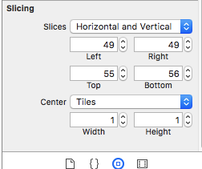

# UI控件使用注意
####UILabel
- label如果在xib、sb中想让文字换行，可以使用option+回车键 - 别忘记numberRows=0

- Label在使用自动布局的时候,如果文字数量是不确定的,需要设置一个属性(preferredMaxLayoutWidth)明确告知label的最大宽度,避免由于自动布局导致的底部多出间距，这样最后计算得出的label的宽度以及高度才是最准确的。这个操作属于一次性操作，最好在初始化方法里面设置。

- 半透明Label
 - self.mylabel.backgroundColor=[UIColor colorWithRed:0 green:0 blue:0 alpha:0.1];

- 使用frame方法计算Label文字尺寸


```objc
-(CGSize)sizeWithtext:(NSString *)text andFont:(UIFont *)font andmaxw:(CGFloat)Maxw
{//text,就是需要计算尺寸的文字
//font,文字的字体大小，注意这个字体需要2个地方设置统一(1.创建label的地方，初始化label字体大小时,2.计算文字大小的地方，字典的字体属性设置时)
//Maxw，label的最大宽度，可以设置成[UIScreen mainscreen].bouns.size.width-2*space
    NSMutableDictionary *attrs=[[NSMutableDictionary alloc]init];
    attrs[NSFontAttributeName]=font;
    CGSize maxsize=CGSizeMake(Maxw, MAXFLOAT);
    return  [text boundingRectWithSize:maxsize options:NSStringDrawingUsesLineFragmentOrigin attributes:attrs context:nil].size;
}
```
 -
####UIImageView
- 以此方法创建的imageview，默认大小就是图片的大小，而且位置会默认是左上角
```objc
UIImageView *imageview=[[UIImageView alloc]initWithImage:[UIImage imageNamed:@"222"]];
```
- UIImageView *imageView=[[UIImageView alloc] initWithImage:image];<br>
  该方法创建的imageView不需要再去设置尺寸，它的尺寸默认就是image里面图片的尺寸(image.size)

- 当图片显示在导航条的时候告诉系统不要渲染我的图片<br>
   UIImage *image=[[UIImage alloc]init];<br>
   [image imageWithRenderingMode:UIImageRenderingModeAlwaysOriginal];
- 加载图片产生缓存
 - 使用[UIImage imageNamed:]加载的图片是会有缓存的，<br>
   - 图片比较小，使用频率高的图片
 - 使用[UIImage imageWithContentsOfFile:]加载图片没有缓存

- 内容模式(contentMode),控制图片如何显示<br>
  //**带有Scale的就有可能被拉伸，没有的就不会被拉伸**<br>
  //**带有Aspect的会保持图片原来的宽高比进行拉伸**
 - UIViewContentModeScaleToFill<br>
  //默认取值，拉伸图片直至填充整个imageView为止

 - UIViewContentModeScaleAspectFit<br>
  //拉伸至刚好看到整个图片为止就停止拉伸
 - UIViewContentModeScaleAspectFill<br>
  //拉伸至宽度或者高度等于imageview的宽度或者高度就不再拉伸并且把图片居中显示

 -  其他模式
```objc
    UIViewContentModeCenter,
    UIViewContentModeTop,
    UIViewContentModeBottom,
    UIViewContentModeLeft,
    UIViewContentModeRight,
    UIViewContentModeTopLeft,
    UIViewContentModeTopRight,
    UIViewContentModeBottomLeft,
    UIViewContentModeBottomRight,
```
- 帧动画
```objc
-(void)playWithCount:(int)count andName:(NSString *)name andMusic:(NSString *)music
{
    if(self.imageviewtest.isAnimating==YES)return;
    NSMutableArray *array=[NSMutableArray array];
    for (int i=1;i<=count;i++) {
        NSString *picname=[NSString stringWithFormat:@"%@_%d",name,i];
        NSString *path=[[NSBundle mainBundle]pathForResource:picname ofType:@"png"];
        UIImage *image=[UIImage imageWithContentsOfFile:path];
        [array addObject:image];
    }
    self.imageviewtest.animationImages=array;
    self.imageviewtest.contentMode= UIViewContentModeBottomLeft;
    self.imageviewtest.animationRepeatCount=[name isEqualToString:@"stand"]?1:1;
    self.imageviewtest.animationDuration=count*0.05;
    [self.imageviewtest startAnimating];
    if ([name isEqualToString:@"stand" ]) return;
    //NSString *path=[[NSBundle mainBundle] pathForResource:@"dazhao.mp3" ofType:nil];
    //[self performSelector:nil withObject:nil afterDelay:self.imageviewtest.animationDuration];
    self.myplayer=[AVPlayer playerWithURL: [[NSBundle mainBundle]URLForResource:music withExtension:nil]];
    [self.myplayer play];
}
```


####UIButton
- 如果是代码的方式创建按钮，以下两个方式创建的都是自定义样式
```objc
 UIButton *btn=[UIButton buttonWithType:UIButtonTypeCustom];
 UIButton *btn=[[UIButton alloc]init];
```
- adjustsImageWhenHighlighted=NO
  - 高亮的时候不要给我改变按钮的状态
- 获取按钮的背景图片
 - UIImage *image = btn.currentBackGroundImage
 - 有时候我们需要直接设置按钮的尺寸就是它背景图片的尺寸
   - btn.currentBackGroundImage.size
- UIButton的title居左对齐<br>
 - btn.textLabel.textAlignment = UITextAlignmentLeft
是没有作用的，
 - 我们需要设置
btn.contentHorizontalAlignment = UIControlContentHorizonAlignmentLeft;<br>
 - 但是问题又出来，此时文字会紧贴到左边框，我们可以设置
btn.contentEdgeInsets = UIEdgeInsetsMake(0,10, 0, 0);
使文字距离左边框保持10个像素的距离。
   - 或者调整按钮内部的文字和图片的位置可以自定义按钮，重写layoutSubviews方法，让文字的X值等于0，图片的X值等于文字的最大X值加一个小间距即可
- UIButton图片拉伸
 - 在工程中专门存放图片的文件夹中才可以进行操作，点击对应图片，操作如图所需设置
    
---
  - 如何判断按钮的图片是高亮还是选中,选中状态的图片可以一直保持
  -  按钮的选中状态只能通过代码实现
  -  按钮的高亮状态是系统默认达到,只要当用户一点击按钮,系统就会自动让达到高亮状态

- 写一个UIImage分类（2种方式）<br>

```objc
//老方法,已过期
+(UIImage *)stretchableImage:(UIImage *)stretchImage
{
    return [[[self alloc] init] stretchableImageWithLeftCapWidth:stretchImage.size.width * 0.5 topCapHeight:stretchImage.size.height * 0.5];

}
****-----***按钮的背景图片只可以通过代码去拉伸，sb里面无法设置*****------
+(UIImage *)resizableImageWithImage:(UIImage *)resizingImge
{    //明确图片的上左下右各有多少距离是不需要拉伸的
   imageH=resizingImge.size.height;
   imgaeW=resizingImge.size.width;
    return [[[self alloc] init] resizableImageWithCapInsets:UIEdgeInsetsMake(imageH*0.5, imageW*0.5, imageH*0.5-1, imageW*0.5-1) resizingMode:UIImageResizingModeStretch];
}
```
---
```objc
//让按钮内部的文字和图片交换位置
1、第一种方式
    self.titleLabel.x = 0;
    self.imageView.x = CGRectGetMaxX(self.titleLabel.frame)+10;
2、第二种方式
    if(self.titleLabel.x>self.imageView.x) {
    self.titleLabel.x = self.imageView.x;
    self.imageView.x = CGRectGetMaxX(self.titleLabel.frame)  }
```
---
####UITextField和键盘相关注意点
- 退出键盘和弹出键盘
 - [textField resignFirstResponder];
 - [textField endEditing:YES];
 - [textField becomeFirstResponder];
- 替换掉系统的键盘view---inputView
  - self.mytext.inputView=自定义的view
- 给键盘view的最上面添加一个自定义view
 -  self.mytext.inputAccessoryView=自定义view

####UIPickerView/UIDatePicker
#####UIPickerView
- PickerView几个重要的方法
 - 人为滚动了pickerView的第component列，滚动到了row行，就会自动调用该方法（代理方法），控制器不仅可以成为PickerView的代理，实现这个方法，同时可以自动调用这个方法，实现自动跳转到自己设置的列和行
   -  -(void)pickerView:(UIPickerView *)pickerView didSelectRow:(NSInteger)row inComponent:(NSInteger)component
 - pickerview调用了这个方法，就会返回选择了第component列的哪一行
   - (NSInteger)selectedRowInComponent:(NSInteger)component;

- 产生不重复的随机值

```objc
- (IBAction)didRandom {

    for (int i=0; i<self.footArray.count; i++) {
        int count=(int)[self.footArray[i] count];
        //由于开始已经把每一列每一行的值设置成0行0列，所以相当于已经有值，
        //得到当前选中的第i列的行号，并将其保存为旧值
        int oldrandom= (int)[self.myPicker selectedRowInComponent:i];
        //设置一个random，让他的初值等于旧值，这样做的目的是为了从第一次开始点击随机按钮，就不让有重复的值出现
        int random=oldrandom;
        //直到出现不重复的值才结束循环，从而保证了没有重复值
        while (random==oldrandom) {
              random=arc4random_uniform(count);
        }
        //实现了这句，就会自动选择第i列的第random行,pickerview就会自动跳转
        [self.myPicker selectRow:random inComponent:i animated:YES];
        //相当于自动调用了pickerView:didSelectRow:inComponent方法，相当于手动选择了第i列第random行，实现了这句，下面的label就会自动显示对应文字，因为之前我们已经实现了这个方法，并在这个方法内部设置了label的文字
        [self pickerView:self.myPicker didSelectRow:random inComponent:i];
}
```
- 让pickerView默认自动选择第i列第0行
```objc
 for (int i=0; i<3; i++) {
        [self pickerView:self.myPicker didSelectRow:0 inComponent:i];
 }
```
- 二级联动bug解决
 - 自己定义一个pIndex属性，用它时刻记录当前省份的行号，后续任何用到省份行号的地方都用pIndex代替就可以了

#####UIDatePicker
- 这个控件需要自己设置日期示格式，另外需要自己addTarget方法去监听
