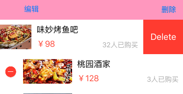

##UIScrollView
- contentOffset<br>
 - scrollView左上角-内容的左上角==屏幕的左上角-内容的左上角==可视范围的左上角-内容的左上角
 - 基于scrollView左上角，默认等于CGPointZero，用来设置scrollView的滚动偏移量<br>
    scrollView.contentOffset = CGPointMake(-20, -10);
    
 - 如果有内边距存在的话，实质上内容的尺寸和内边距是分开的，内边距并不会计算在内容范围之内
- contentSize
 - scrollView的可滚动范围大小，内容的尺寸
- contentInset
 - 默认是UIEdgeInsetsZero，用来设置scrollView的额外滚动区域，这个区域初始情况是不会出现的，但是滚动过程中额外区域一旦出现，就回不去（额外区域无法消失）,而且这个额外区域部分也属于scorllview，但是内边距和内容是不一样的，此时整个scorllview是内容和额外区域的总和，而内容还是之前的内容，比如内容还是图片的大小
- bounces
 - 默认为YES，用来设置scrollView的弹簧效果
- pagingEnabled
 - 默认为NO，用来设置scrollView是否开启分页.
- showsHorizontalScrollIndicator
 - 默认为YES，用来设置scrollView是否显示水平滚动条，实际中一般设置为NO.
- showsVerticalScrollIndicator
 - 默认为YES，用来设置scrollView是否显示垂直滚动条,实际中一般设置为NO.
- minimumZoomScale和maximumZoomScale
 - 用来设置scrollView最小和最大缩小比例
- UIScrollView有个keyboardDismissMode属性，设置成UIScrollViewKeyboardDismissModeOnDrag就可以在拖拽ScrollView的时候自动缩起键盘

- 根据偏移量设置导航条淡出效果
 -


## UITableView
`松散知识点`
```objc
     1、plain样式顶部标题会停留，滚动过程中会被顶走，group样式不会
     2、每当有一个cell进入我们视野范围内的时候，就会调用
     - (UITableViewCell *)tableView:(UITableView *)tableView cellForRowAtIndexPath:(NSIndexPath *)indexPath
     {}
     3、在UITabelViewcontroller中，self.view==self.tableView
     4、想给cell内部添加子控件，添加到cell.contentView
     5、方法estimatedHeightForRowAtIndexPath，估计高度
     * 返回每一行的估计高度
     * 只要实现了这个方法，就会先返回一个估计高度，那么就会先调用tableView:cellForRowAtIndexPath:方法创建cell，再调用tableView:heightForRowAtIndexPath:方法获取对应行号的 cell的真实高度
     而如果不实现这个方法，那么就会先调用高度的方法，再调用创建cell的方法，但是这样是不好的
       -(CGFloat)tableView:(UITableView *)tableView estimatedHeightForRowAtIndexPath:(NSIndexPath *)indexPath
         {
           return 200;
         }
     6、cellForRowAtIndexPath这个方法根据传入的indexPath可以获得显示在tableView上的某一行cell
     7、indexPathForSelectedRow
     可以在系统没有传入indexPath的方法或者自定义的方法中，通过该方法获得被选中的cell的indexPath，可以得到section，row
     NSIndexPath *indexPath=[self.tableView indexPathForSelectedRow];
     8、layoutIfNeeded（强制布局）
     告诉控件拿到对应数据之后立即计算自己尺寸和位置明确自己摆放到哪里
     9、代码方式创建自定义cell，无论是自己创建cell还是让系统去注册对应类型的cell，都会调用initWithStyle方法
     //自定义cell和自定义其他控件不一样，自定义cell会调用initWithStyle而不是initWithFrame
     10、
     //告诉Tableview所有cell的真实高度是自动计算的(根据设置的约束自动计算)
     self.myTabelview.rowHeight=UITableViewAutomaticDimension;
     //骗一下它，给他一个估算高度
    self.myTabelview.estimatedRowHeight=44;
     11、//支持编辑模式下多选
    self.mytableView.allowsSelectionDuringEditing=YES;
    //返回的是一个存放选中的多行cell的indexPath的数组
    self.mytableView.indexPathsForSelectedRows

```
- cell的复用创建

```objc
1、根据cell的标识先去缓存池查找标识一样的cell，也就是可循环利用的cell，没有的话自己创建
    - (UITableViewCell *)tableView:(UITableView *)tableView cellForRowAtIndexPath:(NSIndexPath *)indexPath {
         static NSString *ID=@"cell";
         UITableViewCell *cell = [tableView dequeueReusableCellWithIdentifier:ID ];
         if (cell==nil) {
         cell=[[UITableViewCell alloc]initWithStyle:UITableViewCellStyleSubtitle reuseIdentifier:ID];
                        }
         cell.textLabel.text=[NSString stringWithFormat:@"这是第%ld组cell",indexPath.row];
         return cell;
}

2、在view加载完毕的时候注册一个带有指定标识的cell类型，然后在cellForRowAtIndexPath方法中，先去缓存池找有没有可循环利用的cell，找不到就会自动创建之前注册好类型的带有标识的cell返回给你，设置数据
//这种方法创建的如果是系统自带的cell，那么无法自己设置样式
//所以这种创建cell的方式一般用在自定义cell
[self.tableView registerClass:[UITableViewCell class] forCellReuseIdentifier:ID];

- (UITableViewCell *)tableView:(UITableView *)tableView cellForRowAtIndexPath:(NSIndexPath *)indexPath {
    UITableViewCell *cell = [tableView dequeueReusableCellWithIdentifier:ID ];
    cell.textLabel.text=[NSString stringWithFormat:@"这是第%ld组cell",indexPath.row];
    return cell;
}

3、结合stotyboard创建复用cell,首先会去缓存池查找，找不到会去storyboard找看有没有对应标识的cell，有的话就创建这种类型的cell给你，你再赋值
  - (UITableViewCell *)tableView:(UITableView *)tableView cellForRowAtIndexPath:(NSIndexPath *)indexPath {
    UITableViewCell *cell = [tableView dequeueReusableCellWithIdentifier:ID ];
    cell.textLabel.text=[NSString stringWithFormat:@"这是第%ld组cell",indexPath.row];
    return cell;
}
```
- cell的更新、删除、添加

```objc
1、首先对模型进行对应的操作；
2、其次可以使用[self.tableView reloadData]对显示在眼前的整个tableview进行更新，该方法会
重新调用多少行以及每一行显示什么样的cell的的那2个方法；
  或者使用单独的操作，比如：
  //删除cell，可以调用
  deleteRowsAtIndexPaths:@[indexPath] withRowAnimation:UITableViewRowAnimationBottom
  //添加cell,实质就是插入指定位置，可以调用
  [self.tableView insertRowsAtIndexPaths:@[indexPath] withRowAnimation:UITableViewRowAnimationBottom];
  //更新cell，可以调用
  [self.tableView reloadRowsAtIndexPaths:@[indexPath] withRowAnimation:UITableViewRowAnimationBottom];

  ******左滑出现删除按钮******
  //删除按钮默认是英文，可以通过一个代理方法返回一个字符串去修改这个文字，或者在项目的工程配置中添加支持简体中文
-(void)tableView:(UITableView *)tableView commitEditingStyle:(UITableViewCellEditingStyle)editingStyle forRowAtIndexPath:(NSIndexPath *)indexPath
{
    NSLog(@"----%ld,%zd",editingStyle,indexPath.row);
    [self.deals removeObjectAtIndex:indexPath.row];
    //[self.tableView reloadData];
    [self.tableView deleteRowsAtIndexPaths:@[indexPath] withRowAnimation:UITableViewRowAnimationBottom];
}

  ******自定义一个编辑按钮，点击出现删除选项******
  //带动画
    [self.tableView setEditing:!self.tableView.isEditing animated:YES];
    //不带动画
    self.tableView.editing=!self.tableView.isEditing;
```

```objc
******Tableview自动滚动到指定行******
//点击某个按钮，或者执行某个方法之后，tableview自动滚动到指定行
NSIndexPath *indexpath=[NSIndexPath indexPathForRow:self.marray.count-1 inSection:0];
[self.tableview scrollToRowAtIndexPath:indexpath atScrollPosition:UITableViewScrollPositionBottom animated:YES];
```
